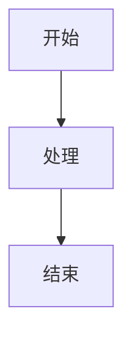

# Mizuki 博客主题

[English](README_en.md) | 简体中文

一个基于 [Astro](https://astro.build/) 构建的现代化个人博客主题，简洁高效、功能丰富。

---

## ✨ 特性

- 🚀 **高性能** - 基于 Astro 静态生成，速度极快
- 🎨 **双主题** - 支持亮色/深色模式，无缝切换
- 📱 **响应式** - 完美适配桌面端和移动端
- 🗨️ **评论系统** - 内置 Twikoo 评论支持
- 🎵 **音乐播放器** - 支持自定义歌单
- 👾 **Live2D 看板娘** - 可爱的交互式虚拟形象
- 📊 **数据可视化** - 技能图表、时间线展示
- 🔍 **搜索功能** - 全文搜索支持
- 🖼️ **相册系统** - 精美的照片展示
- 📝 **Markdown 增强** - 丰富的 Markdown 扩展支持
- 🔒 **加密文章** - 支持密码保护内容
- 🌐 **国际化** - 多语言支持

---

## 📁 项目结构

```
Mizuki/
├── .github/              # GitHub 配置
│   └── workflows/        # GitHub Actions 工作流
├── docs/                 # 文档目录
├── public/               # 静态资源
│   ├── assets/           # 图片资源
│   ├── favicon/          # 网站图标
│   ├── js/               # JavaScript 脚本
│   └── pio/              # Live2D 看板娘资源
├── scripts/              # 构建脚本
├── src/                  # 源代码
│   ├── components/       # Astro 组件
│   │   ├── comment/      # 评论组件
│   │   ├── control/      # 控制组件
│   │   ├── layout/       # 布局组件
│   │   ├── misc/         # 杂项组件
│   │   ├── skills/       # 技能组件
│   │   └── widget/       # 小部件组件
│   ├── constants/        # 常量定义
│   ├── content/          # 内容文件
│   │   ├── posts/        # 博客文章
│   │   └── spec/         # 固定页面
│   ├── data/             # 数据文件
│   ├── layouts/          # 页面布局
│   ├── pages/            # 页面路由
│   ├── plugins/          # Astro 插件
│   ├── scripts/          # 客户端脚本
│   ├── styles/           # 样式文件
│   ├── types/            # TypeScript 类型
│   └── utils/            # 工具函数
├── package.json          # 项目配置
├── astro.config.mjs      # Astro 配置
└── tsconfig.json         # TypeScript 配置
```

---

## 🛠️ 环境准备

### 1. 安装 Node.js

访问 [Node.js 官网](https://nodejs.org/) 下载 LTS 版本，或使用 winget 安装：

```powershell
winget install OpenJS.NodeJS.LTS
```

验证安装：

```cmd
node --version
npm --version
```

> **要求**: Node.js 版本 >= 18.0.0

### 2. 安装 Git

访问 [Git 官网](https://git-scm.com/) 下载安装，或使用 winget：

```powershell
winget install Git.Git
```

验证安装：

```cmd
git --version
```

### 3. 安装 pnpm

Mizuki 项目强制使用 pnpm 作为包管理器。在终端中执行：

```cmd
npm install -g pnpm
```

验证安装：

```cmd
pnpm --version
```

---

## 🚀 快速开始

### 克隆项目

```cmd
git clone https://github.com/matsuzaka-yuki/Mizuki.git
cd Mizuki
```

### 安装依赖

```cmd
pnpm install
```

> **注意**: 如果安装被终止，提示 "Command not found" 或 "Only pnpm is allowed"，请确保已正确安装 pnpm。

### 同步内容（可选）

如果项目启用了内容分离功能：

```cmd
pnpm sync-content
```

### 启动开发服务器

```cmd
pnpm dev
```

启动成功后，浏览器访问 **http://localhost:4321**

---

## 📖 常用命令

| 命令 | 说明 |
|------|------|
| `pnpm dev` | 启动开发服务器（支持热重载） |
| `pnpm build` | 构建生产版本 |
| `pnpm preview` | 预览构建结果 |
| `pnpm new-post <名称>` | 创建新文章 |
| `pnpm format` | 格式化代码 |
| `pnpm type-check` | 类型检查 |
| `pnpm sync-content` | 同步内容仓库 |

---

## 📝 创建新文章

### 方法一：使用命令行（推荐）

```cmd
pnpm new-post my-first-post
```

这会在 `src/content/posts/` 创建新文章模板。

### 方法二：手动创建

1. 在 `src/content/posts/` 下创建 `.md` 文件
2. 添加 Front-matter：

```markdown
---
title: 我的第一篇文章
published: 2025-01-28
description: 文章描述（SEO用）
image: /images/cover.jpg
tags: [标签1, 标签2]
category: 分类
draft: false
lang: zh-CN
---
```

### Front-matter 字段说明

| 字段 | 必填 | 说明 |
|------|------|------|
| `title` | 是 | 文章标题 |
| `published` | 是 | 发布日期 (YYYY-MM-DD) |
| `description` | 否 | SEO 描述 |
| `image` | 否 | 封面图片路径 |
| `tags` | 否 | 标签数组 |
| `category` | 否 | 分类 |
| `draft` | 否 | 草稿标记，true 不发布 |

---

## 🎨 自定义配置

### 修改站点信息

打开 `src/config.ts`，修改站点配置：

```typescript
export const siteConfig: SiteConfig = {
  title: "你的博客名",
  subtitle: "博客副标题",
  siteURL: "https://你的用户名.github.io/仓库名/",
  siteStartDate: "2025-01-01",
  // ...
};
```

### 修改头像

准备头像图片（建议 200x200 像素，支持 PNG/JPG/WebP），将图片放入 `public/assets/images/` 目录并重命名为 `avatar.png`。

或者在 `src/config.ts` 中修改 `profileConfig.avatar` 配置。

### 修改首页轮播图

**桌面端横幅**（建议 1920x600 像素）：
```
public/assets/desktop-banner/
```

**移动端横幅**（建议 750x600 像素）：
```
public/assets/mobile-banner/
```

在 `src/config.ts` 中修改 `banner` 配置来启用/禁用轮播、设置切换间隔等。

### 添加友链

编辑 `src/data/friends.ts` 文件：

```typescript
export const friends: Friend[] = [
  {
    name: "友链名称",
    url: "https://友链网址.com",
    avatar: "/assets/images/friend-avatar.png",
    description: "友链描述",
  },
  // 添加更多友链...
];
```

### 修改关于页面

编辑 `src/content/spec/about.md` 文件。

### 配置评论系统

在 `src/config.ts` 中配置 Twikoo：

```typescript
export const commentConfig: CommentConfig = {
  type: "twikoo",
  options: {
    envId: "你的环境ID",
    region: "ap-shanghai",
  },
};
```

### 音乐播放器

在 `src/config.ts` 中配置音乐播放器：

```typescript
export const musicPlayerConfig: MusicPlayerConfig = {
  enable: true,
  autoplay: false,
  showPlaylist: true,
  defaultMusic: [
    {
      name: "歌曲名",
      artist: "艺术家",
      url: "/music/song.mp3",
      cover: "/images/cover.jpg",
    },
  ],
};
```

### 看板娘配置

在 `src/config.ts` 中配置 Live2D 看板娘：

```typescript
export const pioConfig: PioConfig = {
  enable: true,
  model: "pio",
  expressions: {
    default: "expressions/normal.exp.json",
    home: "expressions/normal.exp.json",
    blog: "expressions/normal.exp.json",
  },
};
```

### 自定义样式

项目使用 CSS 变量系统，修改 `src/styles/variables.styl` 文件可以自定义主题颜色、字体等：

```stylus
// 主色调
--primary-color: #your-color

// 字体
--font-family: "你的字体"

// 暗色模式
--dark-bg: #1a1a2e
--dark-text: #e0e0e0
```

---

## 🚀 部署到 GitHub Pages

### 步骤 1：修改站点配置

确保 `src/config.ts` 中的 `siteURL` 正确配置：

```typescript
export const siteConfig: SiteConfig = {
  title: "你的博客名",
  subtitle: "博客副标题",
  siteURL: "https://你的用户名.github.io/仓库名/", // 必须以斜杠结尾
  // ...
};
```

### 步骤 2：推送代码到 GitHub

```cmd
git init
git remote add origin https://github.com/你的用户名/仓库名.git
git add .
git commit -m "Initial commit"
git branch -M main
git push -u origin main
```

### 步骤 3：配置 GitHub Pages

1. 进入 GitHub 仓库页面
2. 点击 **Settings** → **Pages**
3. 在 **Source** 下选择：
   - **Branch**: `gh-pages`
   - **Folder**: `/(root)`
4. 点击 **Save**

### 步骤 4：自动构建

项目已内置 `.github/workflows` 配置，Push 代码后会自动构建并部署。

首次推送后，构建产物会自动部署到 `gh-pages` 分支。

### 步骤 5：访问你的博客

构建完成后，访问：`https://你的用户名.github.io/仓库名/`

---

## 📦 内容分离（可选）

如果需要将内容存储在独立仓库：

### 启用内容分离

1. 在 GitHub 创建内容仓库
2. 将内容仓库克隆到 `content/` 目录：
   ```cmd
   git clone https://github.com/你的用户名/mizuki-content.git content
   ```
3. 运行同步命令：
   ```cmd
   pnpm sync-content
   ```

详细配置请参考 [内容分离文档](docs/CONTENT_SEPARATION.md)

---

## 🔧 高级配置

### SEO 优化

在 `src/config.ts` 中配置 SEO：

```typescript
export const seoConfig: SEOConfig = {
  title: "站点标题",
  description: "站点描述",
  ogImage: "/assets/images/og-image.png",
  twitterCard: "summary_large_image",
};
```

### 加密文章

创建加密文章时，设置 `encrypt` 字段：

```markdown
---
title: 加密文章
published: 2025-01-28
encrypt: true
password: "你的密码"
---
```

### 使用 Mermaid 图表

```markdown

```

### 使用 Admonitions

```markdown
:::tip
这是一个提示
:::

:::warning
这是一个警告
:::

:::danger
这是一个危险提示
:::
```

---

## ❓ 常见问题

### 开发服务器无法启动？

```cmd
# 删除缓存重新安装
rd /s /q node_modules
del pnpm-lock.yaml
pnpm install
pnpm dev
```

### 图片不显示？

1. 图片必须放在 `public/` 目录下
2. 路径要以 `/` 开头（相对于 public 目录）
3. 确保图片格式正确（PNG、JPG、WebP）

### 构建失败？

1. 检查 Node.js 版本：`node --version`（需要 >= 18）
2. 运行类型检查：`pnpm type-check`
3. 清理缓存：`pnpm clean`

### 部署后样式丢失？

1. 检查 `siteURL` 是否正确配置
2. 确保没有使用绝对路径引用资源
3. 检查 GitHub Pages 的 Source 配置

### 评论区无法加载？

1. 检查 Twikoo 环境 ID 是否正确
2. 确认域名已在 Twikoo 后台配置
3. 检查网络连接

---

## 📄 许可证

本项目基于 MIT 许可证开源。

---

## 🙏 致谢

- [Astro](https://astro.build/) - 现代化的静态站点生成器
- [Svelte](https://svelte.dev/) - 渐进式 JavaScript 框架
- [Twikoo](https://twikoo.js.org/) - 简洁安全的评论系统

---

祝你使用愉快！🎉
