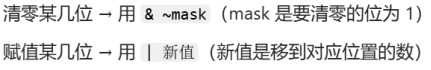
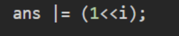
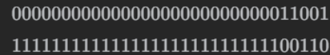
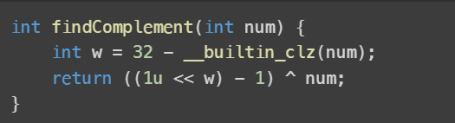

# 从集合论到位运算，常见位运算技巧分类总结！
## 前言
集合可以用二进制数表示：二进制从低到高第 i位为 1 表示 i在集合中，为 0 表示 i不在集合中。例如集合 {0,2,3}可以用二进制数 1101 表示；反过来，二进制数 1101 就对应着集合 {0,2,3}。
利用这种对应关系，集合运算可以完全等价地转换为位运算，这也是很多算法题高效解法的核心思路。

## 一、集合与集合运算对应
### 集合运算与位运算对应关系
### 1.交集
- 集合： A ∩ B
- 位运算： a & b
- 示例：
  - 集合：{0,2,3} ∩ {0,1,2}={0,2}
  - 位运算： 1101 & 0111 = 0101

### 2.并集
- 集合： A ∩ B
- 位运算： a & b
- 示例：
  - 集合：{0,2,3} ∪ {0,1,2}={0,1,2,3}
  - 位运算： 1101 | 0111 = 1111

### 3.对称差(只属于其中一个集合，而不属于另一个集合的元素组成的集合，也就是不在交集中的元素组成的集合。)
- 集合： A △ B
- 位运算： a ^ b
- 示例：
  - 集合：{0,2,3} △ {0,1,2}={1,3}
  - 位运算： 1101 ^ 0111 = 1010

### 4.差集
- 集合： A \ B
- 位运算： a & ~b
- 示例：
  - 集合：{0,2,3} \ {1,2}={0,3}
  - 位运算： 1101 & 1001 = 1001

### 5.子集差集(B⊆A时的 A∖B)
- 集合： A \ B, B⊆A
- 位运算： a ^ b
- 示例：
  - 集合：{0,2,3} \ {0,1,2}={3}
  - 位运算： 1101 ^ 0101 = 1000  
  
### 6.包含关系  
- 集合： A⊆B
- 位运算： a & b == a 或 a | b == b 或 (a & ~b) == 0
- 示例：
  - 集合：{0,2} ⊆ {0,2,3}
  - 位运算： 0101 & 1101 = 0101，0101 | 1101 = 1101  

## 二、集合与集合运算对应  
#### << 表示左移，>> 表示右移。
注：左移 i 位相当于乘以 2^i，右移 i 位相当于除以 2^i。

| 术语 | 集合 | 位运算 | 集合示例 | 位运算示例 |
| ---- | ---- | ------ | -------- | ---------- |
| 空集 | $\emptyset$ | $0$ | | |
| 单元素集合 | $\{i\}$ | $1 << i$ | $\{2\}$ | $1 << 2$ |
| 全集 | $U=\{0,1,2,\dots,n-1\}$ | $(1 << n)-1$ | $\{0,1,2,3\}$ | $(1 << 4)-1$ |
| 补集 | $\complement_U S=U\setminus S$ | $((1 << n)-1) \oplus s$ | $U=\{0,1,2,3\}$<br>$\complement_U \{1,2\}=\{0,3\}$ | $1111 \oplus 0110 = 1001$ |
| 属于 | $i \in S$ | $(s >> i) \& 1 = 1$ | $2 \in \{0,2,3\}$ | $(1101 >> 2) \& 1 = 1$ |
| 不属于 | $i \notin S$ | $(s >> i) \& 1 = 0$ | $1 \notin \{0,2,3\}$ | $(1101 >> 1) \& 1 = 0$ |
| 添加元素 | $S \cup \{i\}$ | $s \mid (1 << i)$ | $\{0,3\} \cup \{2\}$ | $1001 \mid (1 << 2)$ |
| 删除元素 | $S \setminus \{i\}$ | $s \& \sim(1 << i)$ | $\{0,2,3\} \setminus \{2\}$ | $1101 \& \sim(1 << 2)$ |
| 删除元素（一定在集合中） | $S \setminus \{i\}, i\in S$ | $s \oplus (1 << i)$ | $\{0,2,3\} \setminus \{2\}$ | $1101 \oplus (1 << 2)$ |
| 删除最小元素 | | $s \& (s-1)$ | | 见下 |


          s = 101100
        s-1 = 101011 // 最低位的 1 变成 0，同时 1 右边的 0 都取反，变成 1
    s&(s-1) = 101000

- 如果 s 是 2 的幂，那么 s&(s−1)=0。
- 判断x的二进制中是否有相邻1，用：( (x>>1) & x ) == 0表示无相邻1，非0表示有相邻1
- 判断一个数的二进制是否全为1，只需要判断该数+1后是否进位：（x+1）& x == 0.
- n & -n：可以得到n的二进制最右边的1所代表的数值（比如n=1010010，lowbit=2即10）
- n /=（n & -n）*2：除去最右边的1及后面的0，只剩1以前的数字（×2是为了把	1这一位包含进需要移除的部分，把1和后面的0一起打包）
- 快速找到集合s的子集t：t=（t-1）& s (t初始化为s).
- 想要修改某几位二进制，首先需要将二进制的i-j位清除，再移新位进去。

  

      例：把 B 的二进制位，放到 A 的 [i,j] 位 → 先清 A 的 [i,j] 位，再把 B 移到对应位置，最后合并。

      - 把A 的i~j位清零：构造新二进制，i~j是0，其余为1。想要达到这个目的，可以考虑先构造i~j为1，其余位为0，再取反。
        - 构造长j-i+1的全1串：(1ULL << (j-i+1)) - 1；
        - 把全1串移到i位：mask = ((1ULL << (j-i+1)) - 1) << i；
        - 取反得到i~j全为0的掩码：~mask；
        - 清零A的i~j位：N &= ~mask；

      - 把B放到A的i~j位：N | (M << i)

- 想要统计一个数result二进制中1的个数，可以for循环i遍历64位/32位二进制位，
count += (result>>i) & 1。或者使用库函数__builtin_popcount‘ll’(result)。      

- 只包含最小元素的子集，即二进制最低 1 及其后面的 0，也叫 lowbit，可以用 s & -s 算出。

          s = 101100
          ~s = 010011
      (~s)+1 = 010100 // ~s=-s-1
      s & -s = 000100 // lowbit


- 位掩码：如果想要返回一个用二进制数表示的十进制数，二进制数的1又是根据题目条件依次移位加进去的，那么可以将num按位或1，第i位的1就变成1<<i。
如果ans是64位无符号整数（uint64_t ans），此时不能写1，应该写成1ULL.

  
- 想要实现1和0交替出现，i=0可以与1进行异或操作：i ^= 1
-     c语言中想得到取反相同效果，可以与多个1按位异或。如果直接对一个数取反，会对更高位的0取反：

  

      因此仅需要对该数低五位取反：计算num和11111按位异或，11111的个数为num的二进制长度。用__builtin_clz函数计算前导零后，得到长度n，然后1（应该是1u，表示无符号整数）左移n位再减去1得到n位1，再与num按位异或得到取反后的二进制数。

  


### c语言中关于二进制的库函数
- __builtin_clz(num)：统计无符号整数的前导零个数，可以用位数（32/64）减去该结果得到num中的二进制位数
- __builtin_popcount(num)：统计无符号整数二进制中1的个数
- __builtin_parity(num)：统计无符号整数二进制中1的个数的奇偶性，偶数返回0，计数返回1
- __builtin_ctz(num)：统计二进制末尾连续0的个数或者最低位1是第几位。
- __lg(num) + 1：二进制长度
- __lg(num)：集合最大元素


## 三、遍历集合
### 1. 设元素范围从 0 到 n−1，枚举范围中的元素 i，判断 i 是否在集合 s 中。
```c
// 元素范围 0 ~ n-1
// s 是集合
for (int i = 0; i < n; i++) {
    if ((s >> i) & 1) {  // i 在集合 s 中
        // 处理 i 的逻辑
    }
}
```

### 2. 只遍历集合里有的元素
```c
int t = s;
while (t) {
    int lowbit = t & -t;         // 取最低位 1
    t ^= lowbit;                 // 删掉这个元素
    int i = __builtin_ctz(lowbit); // lowbit 对应第几位（C语言内置函数）
    
    // 处理 i 的逻辑
}
```


## 四、枚举集合
### §4.1 枚举所有集合
设元素范围从 0 到 n−1，从空集 ∅ 枚举到全集 U：

```c
// 枚举 0 ~ 2^n - 1 所有集合
for (int s = 0; s < (1 << n); s++) {
    // 处理 s
}
```

### §4.2 枚举非空子集
设集合为 s，从大到小枚举 s 的所有非空子集 sub：

```c
int sub = s;
while (sub) {
    // 处理子集 sub
    sub = (sub - 1) & s;
}
```

### §4.3 枚举 s 的所有子集（包含空集）
如果要从大到小枚举 s 的所有子集 sub（从 s 枚举到空集 ∅），可以这样写：

```c
int sub = s;
while (1) {
    // 处理子集 sub
    
    if (sub == 0) break;
    sub = (sub - 1) & s;
}
```
或者用do...while
```c
int sub = s;
do {
    // 处理子集 sub
} while ((sub = (sub - 1) & s) != 0);
```

### §4.4 枚举超集
如果 T 是 S 的子集，那么称 S 是 T 的超集。
<br>枚举 S，满足 S 是 T 的超集，也是全集 U={0,1,2,…,n−1} 的子集。

```c
int s = t;
while (s < (1 << n)) {
    // 处理超集 s
    s = (s + 1) | t;
}
```